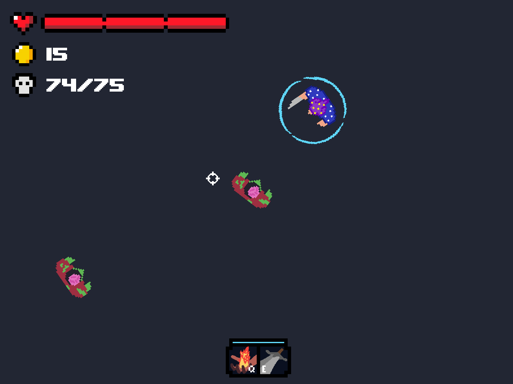
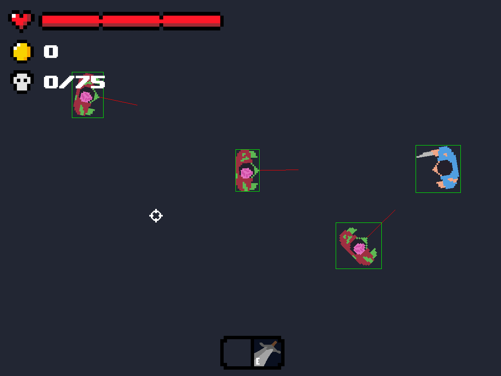
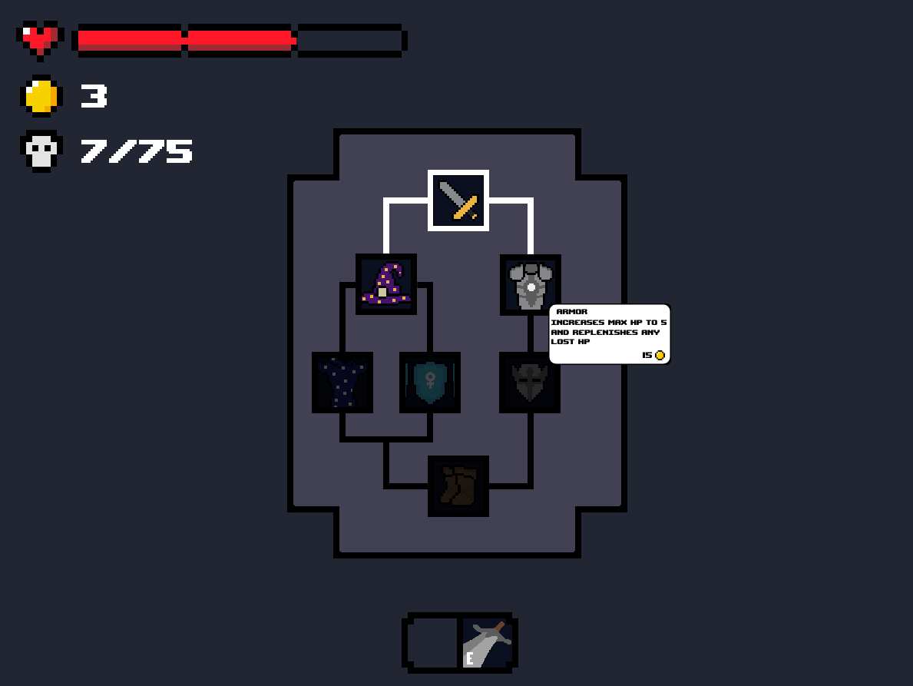

# Knightly Wizard

My second Pygame project!!

### Overivew
You play as a man who, as in my previous game, has to fend off a horde of zombies. Each zombie he kills awards him with some money which he uses to buy upgrades from the skill tree.
He can either choose to go down the path of the noble knight or the clever wizard. It is up to you to decide.

I decided to make the movement vector based and it took a lot of time to understand how to make vectors work they way i want them to by using trigonometric functions.
In the end, i think it would have looked better if i just used simple coordinate based movement :P. 

